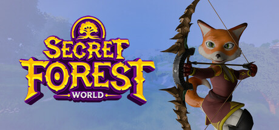
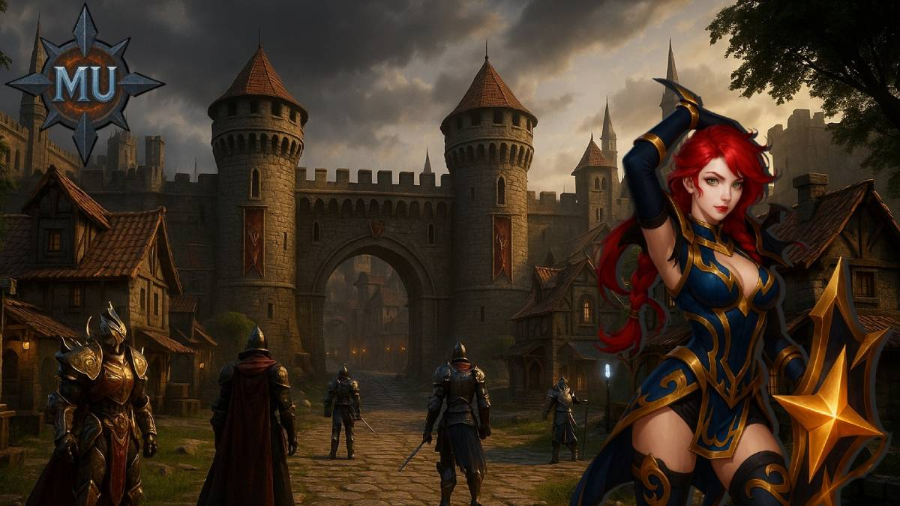
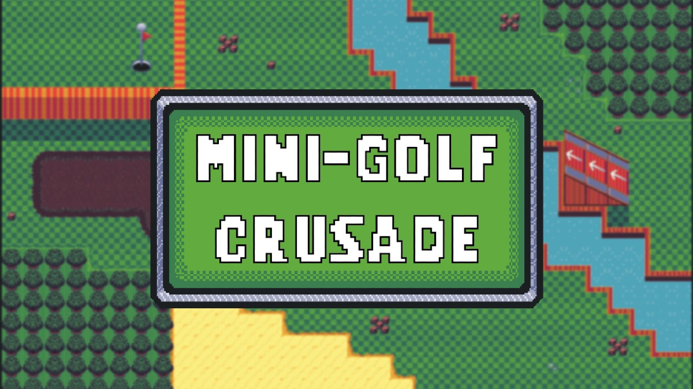
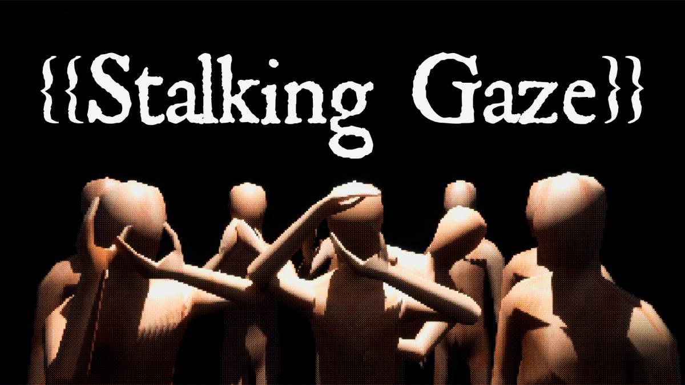
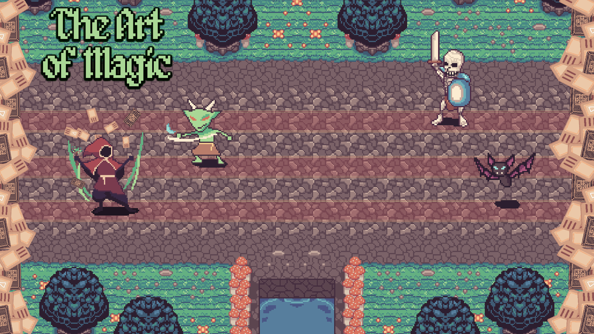

# Fabrizio

**Gameplay & Systems Programmer**

Focused on scalable gameplay architecture, tools, and player feel.

---

## Links

- [LinkedIn](https://www.linkedin.com/in/fabriziopiermarocchi/)
- [GitHub](https://github.com/Piermaa)
- [Itch.io](https://pierma.itch.io/)

---

## Proyects

### [Secret Forest](projects/secret-forest)

MMO in development built with Unreal Engine 5.  
Gameplay systems, Asset Manager usage, scalability-oriented architecture.

### [Mu Online Reforged](projects/mu-online-reforged)

Remake of the classic *Mu Online* developed in Unreal Engine 5.  
Gameplay systems, multiplayer infrastructure, Asset Manager, editor tools, performance optimization.

### [Mini-Golf Crusade](projects/minigolf-crusade)

2D top-down mini-golf metroidvania built in Unity.  
Gameplay systems, physics-driven movement, custom verticality solution, Addressables-based progression.

### [Stalking Gaze](projects/stalking-gaze)

Atmospheric horror walking simulator developed in Unreal Engine.  
Custom event framework designed to allow level designers to easily create, combine, and iterate on horror events and interactions.

### [The Art of Magic](projects/the-art-of-magic)

Mobile deck-building roguelike with a spellcasting system based on on-screen glyph recognition
Selected for the ADVA MPVP Mentorship Program.